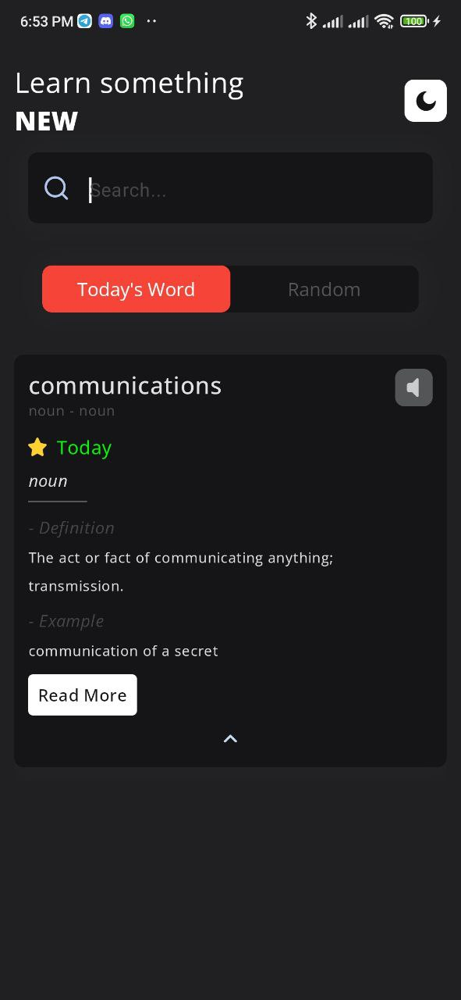

# Word Of The Day

Word Of The Day is a modern, slick, open-source Android dictionary app.

Available on MediaFire Store and soon also on Google Play.

## Screenshots

   
   
   
    
    
  
  
  

## 📚 Android tech stack

One of the main goals of Word Of The Day is to use clean architecture and caching.

### 🧑🏻‍💻 Android development

- Application is entirely written in [Kotlin](https://kotlinlang.org)
- Complete migrated to [Jetpack Compose](https://developer.android.com/jetpack/compose)
- Following the [Material You](https://m3.material.io/) guidelines and dynamic color
- Asynchronous processing using [Coroutines](https://kotlin.github.io/kotlinx.coroutines/)
- Dependency injection with [Hilt](https://dagger.dev/hilt/)
- Database using [Room](https://developer.android.com/topic/libraries/architecture/room)
- Architectural pattern using [Clean Architecture with MVVM](https://blog.cleancoder.com/uncle-bob/2012/08/13/the-clean-architecture.html)
- Data Persistence by [DataStore](https://developer.android.com/topic/libraries/architecture/datastore)
- Restful APIs using [Retrofit](https://square.github.io/retrofit/)

### Features ✨

- Get new words every day
- Remember the yesterday's word
- Get Random Word and its details
- Get a single word details
- Search for a particular word
- Send notification when a new day's word is present
- Light and Dark modes
- Caching with room database
- Listen to the word pronunciation

## Find this repository useful? :heart:
Support it by putting a star for this repository. :star:  
Also, __[follow me](https://github.com/3wiida)__ on GitHub for my next creations! 🤩
